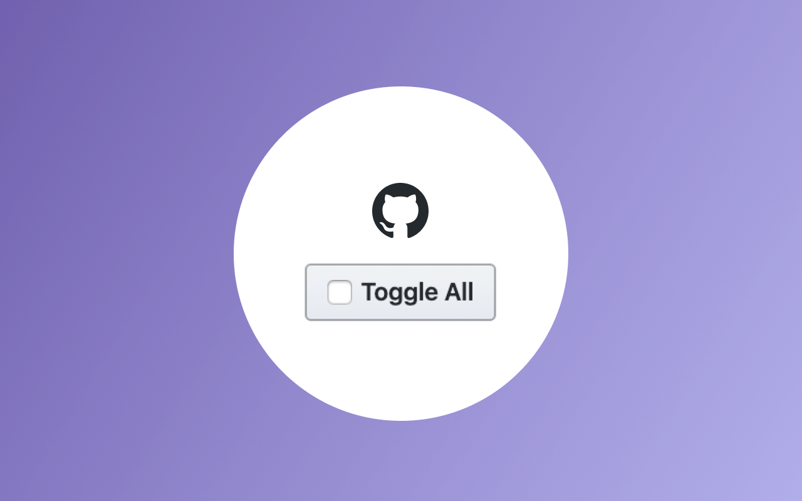

# Github Pull Request Files Checker

[![License][license-badge]][license-url] [![Commitizen][commitizen-badge]][commitizen-url]

☑️ An extension for chrome to make it easy to check the revised files of a pull request.

## Install

This browser extension available for:

|  |
| :------------------------------------------------------------------------------------------------------------------------------------------------------------------------------------------------------------------------------------------------------------: |

| [Chrome](https://chrome.google.com/webstore/detail/codecopy/fkbfebkcoelajmhanocgppanfoojcdmg)

## Testing

### Chrome

1. Navigate to `chrome://extensions`;

2. Click on `Load unpacked extension...`;

3. Select the `github-files-checker` folder;

## Contributing

Please read [CONTRIBUTING.md](CONTRIBUTING.md) for details on our code of conduct, and the process for submitting pull requests to us.

## Versioning

We use [SemVer](https://semver.org/) for versioning. For the versions available, see the [tags on this repository](https://github.com/helderburato/github-files-checker/tags).

## Authors

- **Helder Burato Berto** - _Initial work_ - [helderburato](https://github.com/helderburato)

See also the list of [contributors](https://github.com/helderburato/github-files-checker/contributors) who participated in this project.

## License

This project is licensed under the MIT License - see the [LICENSE](LICENSE) file for details.

[license-badge]: https://img.shields.io/github/license/helderburato/github-files-checker.svg
[license-url]: https://opensource.org/licenses/MIT
[commitizen-badge]: https://img.shields.io/badge/commitizen-friendly-brightgreen.svg
[commitizen-url]: http://commitizen.github.io/cz-cli/
